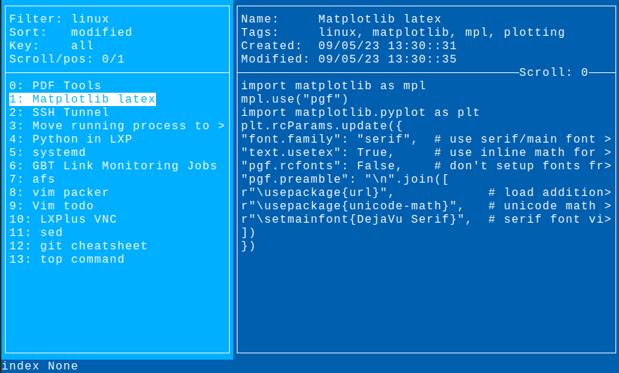

# Terminal note organizing app

## Features
* Take notes stored on a server, editing a local copy, before syncing back to the server
* Edit in $EDITOR
* MVC thread separation to allow loading notes in the background
* Search notes by tags, dates, and names
* vim-like input configured by `setup.py`
